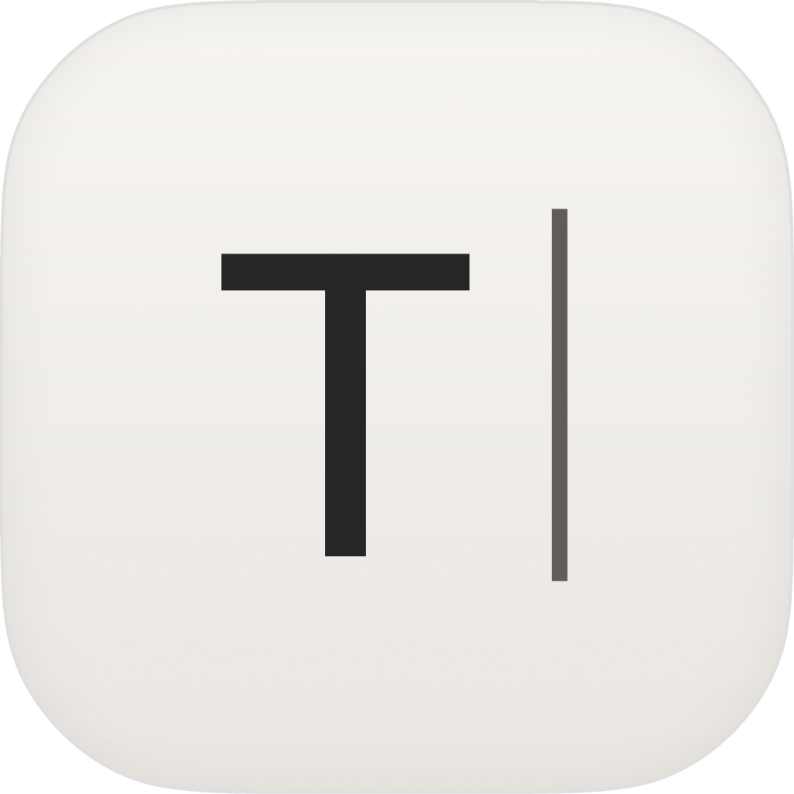

  

<h1 align="center">Trace</h1>

<em>A quiet place to write.</em>

https://github.com/user-attachments/assets/ceab5d7f-4914-4ffe-bc44-c631c6be9335

Trace is a minimal Markdown writer for macOS, built for prose rather than code. It's a heavily reworked fork of the excellent [MarkEdit](https://github.com/MarkEdit-app/MarkEdit) — same fast, native CodeMirror core, reshaped around one idea: **the words are the interface**.

Most Markdown editors make you choose: stare at raw syntax while you write, or split the screen with a preview pane. Trace does neither. The marks fade as you type, what remains reads like the finished piece, and everything else — toolbar, navigation, commands — stays out of sight until you reach for it.

## Download

[**Download Trace**](https://github.com/john-mrty/Trace/releases/latest) — signed and notarized. Unzip, drag to Applications, open.

## Writing without the noise

- **Concealed syntax** — `**`, `#`, `` and friends disappear once written. Links become clickable text with a hover preview, checkboxes become real checkboxes that strike through when done, code blocks sit in panels with a copy button, images and tables render in place (click an image to view it full-size), and frontmatter tucks itself into a Properties chip. One toggle (⇧⌘H) brings back the plumbing as a proper source mode: raw marks, line numbers, live selection status.
- **Seamless glass window** — no title bar band, no toolbar chrome. The document bleeds to the window edge over a subtly blurred backdrop, and scrolled text dissolves into a progressive blur before it reaches the traffic lights, in light and dark.
- **Focus mode** (⇧⌘F) — dims everything except the lines you're working on, with typewriter scrolling holding the caret at the vertical center of the screen. The text moves, you don't.

## Everything within reach, nothing in view

- **File sidebar** (⌘\\) — Tree of the writing files around your document, or rooted at a folder you pick in Settings. Fully keyboard-driven: ↑/↓ to browse, →/← to open folders and files, Obsidian-style. Sort by name, created, or modified. Hidden by default; a quiet icon by the traffic lights slides it in.
- **Command palette** (⌘K) — every menu action, searchable, with fuzzy matching. Type "dark" to switch appearance, "focus" to toggle focus mode. Recent files live there too.
- **Open Document** (⇧⌘O) — jump to any Markdown file near your current document, or any recent file, by typing a few letters of its name. No file browser, no library to maintain.
- **Floating toolbar** — a small capsule at the bottom with the handful of actions prose actually needs: headings, emphasis, lists, syntax visibility, focus mode, and word-count statistics. It recedes while you type and returns when you reach for the mouse.
- **Hover table of contents** — quiet dashes in the top-left mark your place in the document. Hover for the full outline; click to jump.
- **Overlay mode** (⌥`) — summon any document as a floating right-edge panel above your other apps, for notes alongside whatever you're doing.

## When the writing leaves Trace

- **Copy as Rich Text** (⌥⌘C) — paste into Mail, Google Docs, Slack, or Notes with real headings, links, and formatting intact. Plain-text paste still gives you the Markdown source.
- **Plain text files on disk** — no library, no lock-in, no cloud, no data collection. Your documents are `.md` files that outlive any app.

## The small print that isn't small

- **Accent colors** — Amber, Crimson, Fern, Teal, Azure, or Graphite; each tuned separately for light and dark.
- **One theme, done well** — GitHub in light and dark, following the system or pinned to either. Three line heights, from tight to relaxed.
- **A welcome, not a blank stare** — launching without a document shows recent files and New/Open, then gets out of the way.

## What it doesn't do

Trace is deliberately smaller than MarkEdit. The updater, AppleScript and Shortcuts support, the extensions manager, the assistant pane, Pandoc export, and the classic toolbar were all removed. If you want the full-featured editor, use [MarkEdit](https://github.com/MarkEdit-app/MarkEdit) — it's great.

## Under the hood

Everything that makes MarkEdit fast is still here:

- Native AppKit shell with a CodeMirror 6 core — a small app that opens instantly and handles very large documents without breaking a sweat.
- Real Markdown parsing (Lezer, following the GFM spec), not regex.

## Requirements & building

- macOS 15.0+ (the full glass treatment needs macOS 26 Tahoe; earlier versions fall back gracefully)
- Build with Xcode: open `Trace.xcodeproj` and run the **Trace** scheme.
- The editor core lives in `CoreEditor/` (TypeScript). After changing it: `cd CoreEditor && yarn install && yarn build`, then rebuild the app.
- Release builds: `Scripts/release.sh <version>` signs, notarizes, and publishes.

## Credits

Trace is built on [MarkEdit](https://github.com/MarkEdit-app/MarkEdit) by [cyanzhong](https://github.com/cyanzhong) and contributors, released under the MIT license, with [CodeMirror 6](https://codemirror.net/) at its core and [ts-gyb](https://github.com/microsoft/ts-gyb) for code generation. The heart of this app is their work — this fork just gives it a quieter voice.
